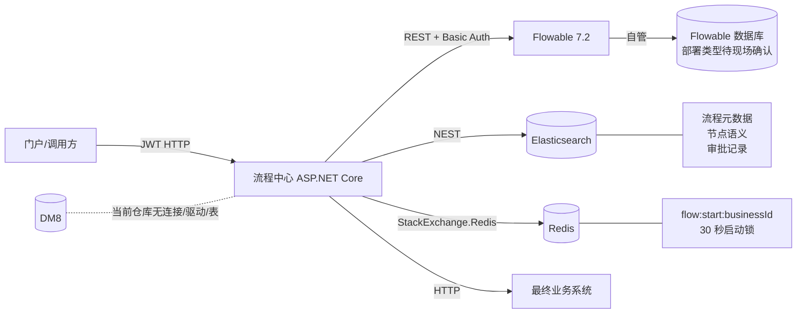
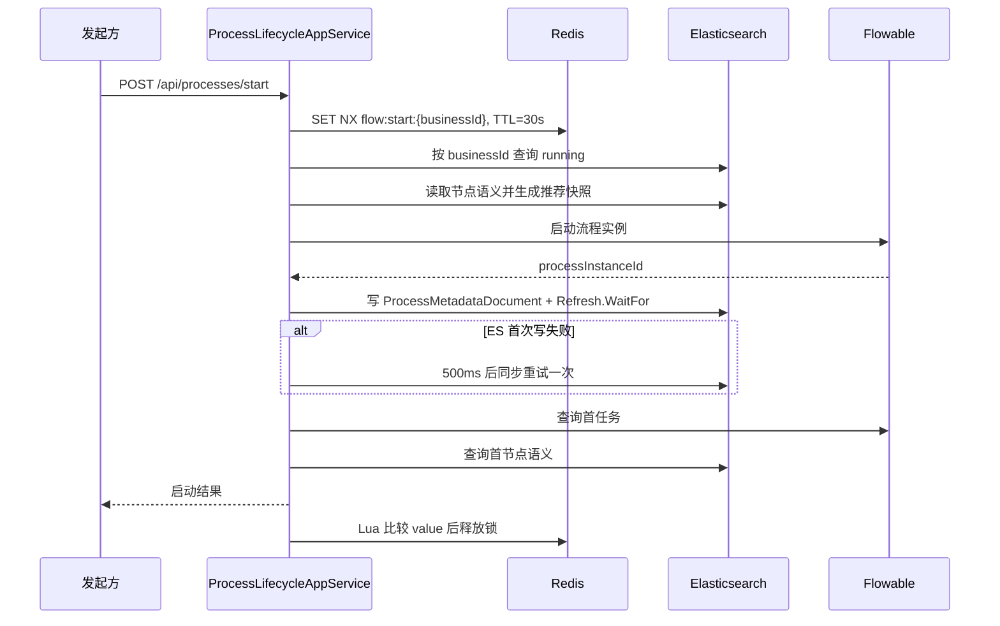
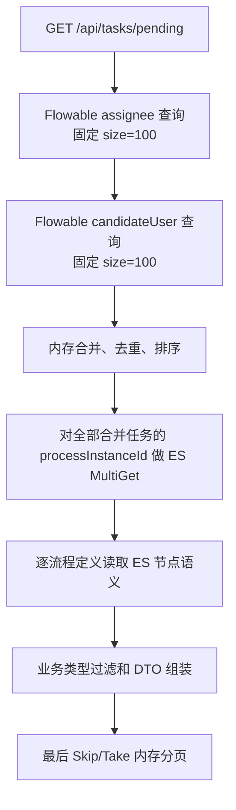
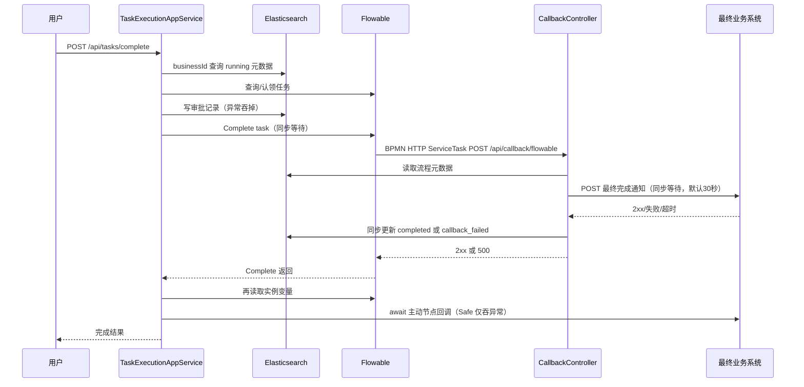
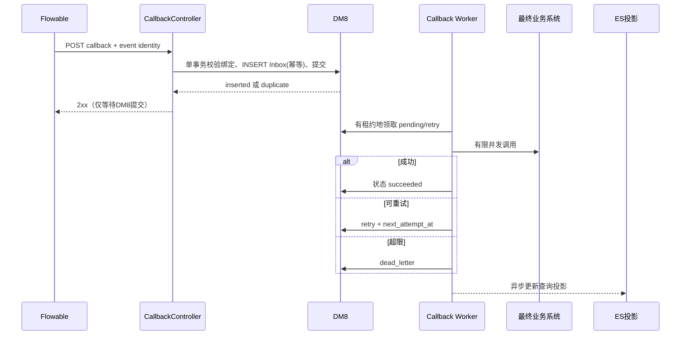

# 流程运行数据与末节点回调治理实施计划

> **执行更新（2026-07-29）**：本计划的职责裁决已实施到当前代码。真实迁移、
> 故障注入和容量停止门禁见
> `docs/2026-07-29-flow-runtime-data-and-callback-final-acceptance.md`。
> 下文“当前仓库无 DM8”等表述是实施前代码基线，用于保留裁决依据。

**日期**：2026-07-29
**状态**：最终实施指令已生效，按 S0→S5 连续实施
**依据**：当前仓库源码、`docs/ask/message.md`、`docs/test-reports/2026-07-29-portal-pressure-test-report.md`
**技术基线**：.NET 6、Flowable 7.2 REST、NEST 7.17.5、StackExchange.Redis 2.12.14
**范围边界**：不修改 Flowable `ACT_*` 表，不用 DM8 替换 Flowable 数据库，不删除 ES，不引入 ClickHouse，不扩张 mTLS/PKI/HMAC、渗透测试、历史审计平台或通用消息中间件。

## 1. 执行摘要

当前流程中心通过 HTTP REST 操作 Flowable；仓库内没有 Flowable PostgreSQL/`ACT_*` 表的直接访问代码，也没有 DM8 驱动、连接或持久化实现。Flowable 及其自管数据库应继续作为流程实例、任务、当前节点和完成状态的运行真相。当前 ES 不是纯查询投影：`flowable-process-metadata` 同时保存唯一的 `businessId → processInstanceId` 绑定、流程级回调配置、推荐人快照和门户状态；`flowable-process-definition-semantic` 保存完成、驳回、转派和选人所需的规则配置；`flowable-audit-records` 还是节点回调上下文的唯一来源。核心动作会先依赖 ES 定位和判定，因此 ES 故障可阻断启动、完成、转派、驳回、终止或令待办消失。

本计划的主裁决是：**Flowable + 自管数据库保持不动；ES 整体保留，但把影响业务执行正确性的唯一数据迁入 DM8，使 ES 收缩为可重建查询投影；DM8 承担流程业务绑定、版本化执行配置、任务动作记录和可靠回调 Inbox；Redis 保留现有分布式启动锁并逐步降级为非权威保护/缓存层。**

当前高并发第一故障点不是 ES，而是末节点的同步闭环：用户完成任务等待 Flowable，Flowable 的同步 HTTP ServiceTask 回调流程中心，流程中心再同步等待最终业务系统并同步更新 ES，之后结果才逐层返回。压力报告已经观察到约 5 秒的 Flowable 出站 HTTP 超时；仓库只能确认流程中心到 Flowable 和流程中心到业务系统的 30 秒配置，无法从当前仓库定位 Flowable 引擎侧 5 秒配置来源。

推荐顺序为：

1. S0 固化代码与真实部署基线、链路指标和故障判据；
2. S1 先用 DM8 Transactional Inbox 切断末节点同步业务调用；
3. S2 再把 ES 中的最小业务真相和执行规则迁入 DM8，并建立 ES 可重建投影；
4. S3 改造待办分页顺序，避免第一页加载每类最多 100 条任务后才分页；
5. S4 收紧 Redis 边界并增加可降级的静态配置缓存/保护能力；
6. S5 按 100、1000、5000、10000、50000 分级重新压测，逐级设停止门槛。

### 1.1 五项核心裁决

| 裁决项 | 明确结论 |
| --- | --- |
| A. Flowable | **保持 Flowable + 其自管事务数据库不动。** 流程实例、运行任务、当前节点、办理人/候选人和任务是否完成以 Flowable REST 为准；流程中心不查询或修改 `ACT_*` 表。 |
| B. Elasticsearch | **主裁决选择“部分业务真相迁往 DM8，ES 保留并降级为查询投影”。** 不整体移除 ES，也不允许继续把业务绑定、执行规则、回调幂等和业务回调状态只放 ES。 |
| C. DM8 | **新增为流程中心的最小业务一致性库。** 保存流程业务绑定、版本化流程执行配置、任务动作事实、回调 Inbox、幂等、重试、死信和人工重投状态；不保存 Flowable 内部运行表，不建设完整业务中台。 |
| D. Redis | **不是新引入，而是已存在。** 保留启动防重锁，但最终防重改由 DM8 唯一约束承担；可选用于版本化配置缓存、限流和短时热点保护。Redis 停机时允许绕过缓存/锁，核心正确性由 Flowable + DM8 保证。 |
| E. 第一故障点 | **末节点同步 HTTP 回调链和由此造成的连接、线程、超时与重试放大。ES 不是本次已证实的第一根因。** 待办实现顺序和 ES 同步耦合是随后必须治理的问题。 |

## 2. 当前代码架构

### 2.1 组件与真实存储



当前代码只通过 Flowable REST 完成部署、启动、任务查询、认领、完成、转派、驳回跳转、实例删除和变量查询。项目依赖中没有 Npgsql、DM8、EF Core 或 Dapper，也没有 `DbConnection`/`DbContext`/`ACT_*` 表访问。仓库可以证明“流程中心不直接碰 Flowable 数据库”，但不能证明测试或生产 Flowable 容器实际使用 PostgreSQL；压力报告反而记录测试容器当时是默认嵌入式、无卷形态，此项必须在 S0 现场核实。

### 2.2 启动流程当前调用链



风险边界：

- Redis 在获取锁前无降级；Redis 不可用会直接令启动失败，甚至可能在应用启动连接阶段不可用。
- “是否已启动”最终依赖 ES `status=running` 查询，不是关系库唯一约束。
- Flowable 启动成功后 ES 连续两次失败会产生 Flowable-only 孤儿实例。
- 锁 TTL 固定 30 秒；压力下请求超过 60 秒时锁可先于请求失效。
- 推荐快照生成异常被捕获后继续启动，推荐人可永久为空。

### 2.3 待办查询当前调用链



代码不是“真正全量读取无限条待办”，而是**分别读取 assignee/candidate 最多 100 条且忽略 Flowable 返回总数，然后才合并和分页**。因此同时存在两类问题：

- 第一页仍可能拉取、合并并补充最多 200 条任务，成本明显大于 `pageSize`；
- 超过两类各 100 条后的任务和总数被静默截断，分页结果可能不完整；
- ES MultiGet 发生在分页前，且 ES 无效响应被转换为空字典，随后任务被 `continue` 跳过；
- `GetPendingTasksRequest.PageSize` 没有硬上限和 `PageIndex >= 1` 校验；
- 节点语义按流程定义在单请求内缓存，避免同定义 N+1，但跨请求仍反复访问 ES。

### 2.4 末节点完成与回调当前调用链



门户资讯审批 BPMN 的 `st03_framework_callback` 是普通同步 `flowable:type="http"` ServiceTask，没有在 BPMN 中配置 `flowable:async`、`failedJobRetryTimeCycle` 或显式 HTTP 超时。其最终业务回调因此处在 Flowable Complete 的同步执行链中。

## 3. 代码证据表

| 结论 | 文件 | 类/方法 | 行号 | 证据 |
| --- | --- | --- | ---: | --- |
| 实际目标框架为 .NET 6，现有旧计划的 .NET 8 描述已漂移 | `process.csproj` | `PropertyGroup` | 3-6 | `TargetFramework` 为 `net6.0`。 |
| 仓库只包含 ES、Redis 等客户端，不包含 DM8/关系 ORM 驱动 | `process.csproj` | `PackageReference` | 14-18 | 依赖只有 JWT、NEST、StackExchange.Redis、Swagger。 |
| Flowable 客户端通过 REST 工作 | `Infrastructure/Flowable/FlowableHttpClient.cs` | `FlowableHttpClient` | 29-46 | 配置 BaseAddress、30 秒超时和 Basic Auth。 |
| 运行时启动、查询、删除均调用 Flowable REST | `Infrastructure/Flowable/FlowableRuntimeServiceImpl.cs` | `StartProcessInstanceByKeyAsync` 等 | 37-139 | 使用 `/runtime/process-instances` 和 `/change-state`。 |
| 项目没有直接访问 `ACT_*` 表 | 全仓库 C# 与项目文件 | 全局搜索 | 无匹配 | 未发现 `ACT_*`、DbContext、DbConnection、DM8、Npgsql、Dapper。 |
| ES 有三个索引 | `Infrastructure/ElasticSearch/ElasticSearchOptions.cs` | `ElasticSearchOptions` | 8-11 | 元数据、审计、流程定义语义三个索引名。 |
| 应用启动强依赖 ES 索引初始化 | `Program.cs` | 顶层启动代码 | 217-220 | `InitializeIndexesAsync()` 在 `app.Run()` 前被等待。 |
| 流程元数据含唯一业务绑定、状态、回调和推荐快照 | `Domain/ElasticSearch/Documents/ProcessMetadataDocument.cs` | `ProcessMetadataDocument` | 10-38 | ES 文档保存这些字段，仓库无其他持久副本。 |
| 节点执行规则只保存在 ES 语义文档 | `Domain/ElasticSearch/Documents/ProcessMetadataDocument.cs` | `NodeSemanticInfo` | 62-140 | 驳回、转派、Slot、角色、回调 URL 均在该对象。 |
| 语义文档按定义 Key 覆盖，不区分版本 | `Domain/ElasticSearch/Documents/ProcessMetadataDocument.cs` | `ProcessDefinitionSemanticDocument` | 206-221 | 文档 ID 是 `ProcessDefinitionKey`，缺少版本字段。 |
| 审批动作记录当前只在 ES | `Domain/ElasticSearch/Documents/ProcessMetadataDocument.cs` | `ProcessAuditRecord` | 228-285 | 操作人、动作、理由、选人和推荐快照均为 ES 文档。 |
| BPMN 先部署到 Flowable，再同步写 ES 语义 | `Application/Services/BpmnDeploymentAppService.cs` | `DeployAsync` | 101-120 | Flowable 成功、ES 失败时会形成定义与语义不一致。 |
| ES 元数据写入强制等待 refresh | `Infrastructure/ElasticSearch/ElasticSearchServiceImpl.cs` | `IndexProcessMetadataAsync` | 149-168 | 使用 `Refresh.WaitFor`。 |
| ES 批量查询失败静默返回空结果 | `Infrastructure/ElasticSearch/ElasticSearchServiceImpl.cs` | `GetProcessMetadataBatchAsync` | 181-203 | `!response.IsValid` 时返回空字典。 |
| 业务 ID 查询把 ES `running` 当执行前置 | `Infrastructure/ElasticSearch/ElasticSearchServiceImpl.cs` | `GetProcessMetadataByBusinessIdAsync` | 209-234 | 查询 `businessId.keyword + status=running`。 |
| ES 状态更新没有乐观并发条件 | `Infrastructure/ElasticSearch/ElasticSearchServiceImpl.cs` | `UpdateProcessStatusAsync` | 237-270 | 直接脚本覆盖 `status/completedTime`，无 seqNo/版本状态机。 |
| 审计写入也等待 refresh | `Infrastructure/ElasticSearch/ElasticSearchServiceImpl.cs` | `IndexAuditRecordAsync` | 334-348 | 每次动作同步 `Refresh.WaitFor`。 |
| Redis 已被注册而非待引入 | `Program.cs` | Redis DI | 37-38, 79-83, 173-174 | 注册 `IConnectionMultiplexer` 和分布式锁服务。 |
| Redis 当前仅用于流程启动锁 | `Application/Services/ProcessLifecycleAppService.cs` | `StartProcessAsync` | 109-125, 346-359 | Key 为 `flow:start:{businessId}`，TTL 30 秒。 |
| Redis 解锁使用 token 校验 Lua | `Infrastructure/DistributedLock/RedisDistributedLockService.cs` | `ReleaseAsync` | 45-76 | 只删除 value 匹配的锁。 |
| 启动去重依赖 ES，而不是关系库唯一键 | `Application/Services/ProcessLifecycleAppService.cs` | `StartProcessAsync` | 127-143 | 先查 ES 中 running 记录。 |
| 推荐快照异常后仍继续启动 | `Application/Services/ProcessLifecycleAppService.cs` | `StartProcessAsync` | 165-188 | 捕获所有异常并保留空字典。 |
| Flowable 启动与 ES 写入是非事务双写 | `Application/Services/ProcessLifecycleAppService.cs` | `StartProcessAsync` | 197-275 | Flowable 成功后写 ES，失败仅固定 500ms 重试一次。 |
| 完成任务先依赖 ES 定位运行实例 | `Application/Services/TaskExecutionAppService.cs` | `CompleteTaskAsync` | 87-99 | ES 不可用或记录缺失会阻断完成动作。 |
| 转派任务先依赖 ES 定位运行实例 | `Application/Services/TaskExecutionAppService.cs` | `ReassignTaskAsync` | 361-397 | ES 不可用或记录缺失会阻断转派。 |
| 终止流程先依赖 ES 定位运行实例 | `Application/Services/ProcessLifecycleAppService.cs` | `TerminateProcessAsync` | 376-402 | ES 不可用或记录缺失会阻断终止。 |
| 审计在 Complete 前写入且可能形成幽灵记录 | `Application/Services/TaskExecutionAppService.cs` | `CompleteTaskAsync` | 122-138 | 代码注释明确承认 Complete 失败后的幽灵审计。 |
| “Safe 回调”仍在用户请求中被 await | `Application/Services/TaskExecutionAppService.cs` | `CompleteTaskAsync` | 161-173 | 节点回调和通知均等待完成后才返回。 |
| 待办分别读取两类最多 100 条 | `Infrastructure/Flowable/FlowableTaskServiceImpl.cs` | `QueryTasksAsync` | 32-39 | 固定追加 `size=100`，没有 start、order 或 total。 |
| 待办先做全部补充、最后内存分页 | `Application/Services/TaskExecutionAppService.cs` | `GetPendingTasksAsync` | 192-219, 229-313 | 两次查询、合并、ES MultiGet、组装后才 Skip/Take。 |
| ES 缺元数据时整个待办被跳过 | `Application/Services/TaskExecutionAppService.cs` | `GetPendingTasksAsync` | 231-238 | `TryGetValue` 失败直接 `continue`。 |
| 待办 pageSize 没有硬上限 | `Application/Dtos/PendingTaskDto.cs` | `GetPendingTasksRequest` | 19-29 | 默认 20，但无验证属性或服务端钳制。 |
| 门户末节点是同步 HTTP ServiceTask | `bpmn/门户资讯审批/portal_content_approval.bpmn` | `st03_framework_callback` | 86-119 | `flowable:type="http"`，直接请求 `frameworkCallbackUrl`。 |
| Flowable 回调接口同步等待应用服务 | `Api/Controllers/CallbackController.cs` | `HandleFlowableCallback` | 55-80 | await 完整处理；异常返回 500。 |
| 回调入口当前匿名且无签名校验 | `Api/Controllers/CallbackController.cs` | `HandleFlowableCallback` | 55-58 | `[AllowAnonymous]`，请求模型只做必填校验。 |
| 最终回调依赖 ES 幂等并同步调用业务系统 | `Application/Services/ProcessCallbackAppService.cs` | `HandleProcessEndCallbackAsync` | 316-362 | ES 终态判断、同步业务 HTTP、同步 ES 状态更新。 |
| 业务回调默认最长等待 30 秒 | `Application/Services/ProcessCallbackAppService.cs` | `CallBusinessSystemAsync` | 559-640 | `HttpClient.SendAsync` 被同步等待，失败再同步标记 ES。 |
| 节点回调吞异常但仍同步占用请求 | `Application/Services/ProcessCallbackAppService.cs` | `PostNodeCallbackSafeAsync` | 503-557 | `await SendAsync` 后才捕获，不是后台执行。 |
| 回调和 Flowable 调用没有传递请求取消令牌 | 多个 Controller/AppService/HTTP Client | 回调、完成、Flowable 请求 | 相关签名 | 生产代码没有 `CancellationToken` 参数，客户端断开不保证停止在途调用。 |
| A/B 慢回调由真实测试控制器支持 | `Api/Controllers/TestController.cs` | `ProcessCallback` | 85-139 | B 组可延迟 1ms 至 120000ms，默认 15 秒。 |
| 压测已观察同步链故障，但未完成 5 万验收 | `docs/test-reports/2026-07-29-portal-pressure-test-report.md` | 阶梯结果 | 全文 | 250 VU 阶段系统停滞，5 万级未继续。 |

## 4. 数据分类清单

### 4.1 分类原则

- **流程运行真相**：只以 Flowable REST 为准，不复制成另一套可写运行引擎。
- **业务执行真相**：必须进入 DM8 并受事务、唯一约束和状态机保护。
- **查询投影**：可留在 ES，允许短暂延迟，必须可从 Flowable、DM8 或部署源重建。
- **缓存/保护状态**：可放 Redis，但丢失后不能改变最终结论。

### 4.2 当前字段裁决

| 数据/字段 | 当前存储 | 当前用途 | 是否影响正确性 | 推荐存储 | 是否迁移 |
| --- | --- | --- | ---: | --- | ---: |
| 流程实例是否存在/是否结束 | Flowable；ES `status` 有副本 | 运行控制、展示 | 是 | Flowable 为唯一运行真相；DM8/ES 只记录业务视角状态 | 不迁移 Flowable 数据 |
| 当前任务、节点、assignee、candidate | Flowable | 完成、认领、转派、待办 | 是 | Flowable；ES 仅补充显示 | 否 |
| `businessId → processInstanceId` | ES 元数据唯一保存 | 定位完成、转派、终止、查询 | 是 | DM8 `workflow_business_instance` 权威；ES 投影 | 是 |
| `businessType` | ES 元数据 | 筛选、回调、路由 | 是 | DM8 绑定权威；ES 投影 | 是 |
| `processDefinitionKey` | Flowable + ES | 查询规则、回调 | 是 | Flowable 运行事实；DM8 绑定和配置版本；ES 投影 | 部分迁移 |
| `processDefinitionVersion` | Flowable 定义 ID；ES 实例文档未保存 | 保证在途实例使用正确规则版本 | 是 | DM8 绑定和定义配置 | 新增 |
| `status=running/completed/terminated` | ES | 去重、列表、终态判断 | 是 | Flowable 运行状态 + DM8 业务绑定状态；ES 投影 | 是 |
| `callback_failed` | ES | 业务回调结果 | 是 | DM8 callback event 状态 | 是 |
| `Callback.Url/Timeout/Retry/Headers` | ES 实例文档唯一保存 | 末节点业务调用 | 是 | DM8 绑定或回调事件快照；敏感 Header 加密/脱敏 | 是 |
| `RecommendedAssigneesSnapshot` | ES 实例文档唯一保存 | 前端选人推荐、审计比对 | 对推荐完整性是 | DM8 业务实例快照；ES 查询副本 | 是 |
| `NodeSemanticMap` 基础展示字段 | ES 语义索引 | 页面、名称、展示 | 否 | DM8 版本化定义配置为源；ES/Redis 投影 | 是，保留副本 |
| `CanReject/CanReassign/RejectOptions/Slots/RoleKey/CallbackUrl` | ES 语义索引唯一保存 | 执行动作校验、变量转换、回调路由 | 是 | DM8 `workflow_definition_config` 权威；Redis 缓存；ES 投影 | 是 |
| 审批动作、操作人、驳回原因、Slot 选择 | ES 审计索引唯一保存 | 历史展示、节点回调上下文 | 是 | DM8 `workflow_task_action` 保存新动作事实；ES 为查询投影 | 是 |
| 门户流程列表字段 | ES | 列表、筛选、排序 | 否 | ES | 否 |
| `flow:start:{businessId}` 锁 | Redis | 降低重复启动并发 | 否，不能作为最终依据 | Redis 保留为 advisory lock；DM8 唯一约束最终防重 | 不迁移锁值 |
| 回调重试次数、死信、下一次执行时间 | 当前无可靠存储 | 当前仅注释/配置，未实现 | 是 | DM8 `workflow_callback_event` | 新增 |
| 静态定义/节点配置缓存 | 当前无跨请求缓存 | 每请求查 ES | 否 | Redis 可选，源为 DM8 | 可选新增 |
| 待办页缓存 | 当前无 | 性能优化候选 | 否 | 暂不实施；S3 证明必要后才用 Redis 1-5 秒缓存 | 当前不新增 |

### 4.3 当前 ES 不是完整“门户业务宽表”

真实 `ProcessMetadataDocument` 只包含流程标识、业务类型、状态、创建信息、回调配置、节点语义副本和推荐快照。未发现标题、部门、表单摘要、全文内容等门户业务字段。因此本计划不虚构这类迁移；后续若部署索引 Mapping 中存在代码模型外动态字段，必须在 S0 实际导出 Mapping 和样本文档后单独归类。

## 5. ES 去留裁决

### 5.1 主裁决

**选择裁决三：ES 中的部分业务真相迁往 DM8；ES 整体保留并降级为查询投影。**

不选择“保持现状”，因为：

- 完成、转派、驳回和终止通过 ES 绑定定位 Flowable 实例；
- 回调幂等以 ES `status` 判断；
- 执行规则和回调 URL 只在 ES 语义文档；
- Flowable 启动成功后 ES 写失败会产生孤儿；
- ES 批量查询无效会让待办静默消失；
- 状态更新缺少显式状态机和乐观并发。

不选择“整体移除”，因为：

- 流程列表、筛选、排序和审计历史查询已经由 ES 实现；
- ES 适合承担可重建查询投影；
- 当前第一故障点是同步回调，而不是 ES 技术本身；
- 立即删除会扩大范围并破坏既有查询契约。

### 5.2 ES 各索引最终职责

| 索引 | 当前处置 | 最终职责 | 禁止事项 |
| --- | --- | --- | --- |
| `flowable-process-metadata` | 保留 | 门户流程列表、筛选、排序、展示状态、业务绑定查询副本 | 不再作为完成/转派/终止的唯一定位来源；不再作为启动唯一防重依据 |
| `flowable-process-definition-semantic` | 保留 | 定义与节点语义的查询投影，支持管理页面和搜索 | 不再作为驳回、转派、Slot 转换、回调路由规则的唯一权威源 |
| `flowable-audit-records` | 保留 | 审批历史查询投影 | 不再作为业务回调上下文或动作幂等的唯一源 |

### 5.3 查询时允许信任与动作前必须复核

允许直接信任 ES 的内容：

- 门户列表显示字段；
- 搜索、筛选、排序结果；
- 页面编码、节点展示名称等非执行字段；
- 可接受短暂延迟的审批历史投影。

执行前不得只信任 ES：

- 任务是否仍存在、是否已完成、当前 assignee/candidate：必须向 Flowable 校验；
- `businessId` 与流程实例绑定、回调状态、幂等键：必须向 DM8 校验；
- 驳回、转派、Slot、回调路由规则：必须读取 DM8 版本化配置，可经 Redis 缓存；
- 流程运行状态：必须以 Flowable 为准；
- 最终业务系统是否已成功处理：必须以 DM8 callback event 状态为准。

### 5.4 投影一致性

- DM8 业务表每次变化增加 `data_version`；ES 文档携带相同版本。
- ES 投影 Worker 只允许从较小版本更新到较大版本，防止乱序覆盖。
- ES 写失败只影响查询新鲜度，不回滚 Flowable 或 DM8 已提交事实。
- 提供按 `businessId`、定义 Key+版本和时间范围的重建命令。
- S2 切换前做双读比对；切换后保留可回滚的 DM8→ES 重建路径。

## 6. 末节点同步链路分析

### 6.1 真实同步边界

1. `TaskController.CompleteTask` 等待 `TaskExecutionAppService.CompleteTaskAsync`。
2. 应用先查 ES、定位/认领 Flowable 任务、同步尝试写 ES 审计。
3. `_taskService.CompleteAsync` 等待 Flowable REST 返回。
4. 门户末节点推进到 `st03_framework_callback`，Flowable 同步 POST `/api/callback/flowable`。
5. `CallbackController` 等待 `HandleFlowableCallbackAsync`。
6. 流程结束分支先查 ES，再等待最终业务 HTTP，最后同步更新 ES。
7. 只有回调返回后 Flowable 才能完成 ServiceTask，并向流程中心返回 Complete 结果。
8. 流程中心随后仍等待一次变量读取、主动节点回调和下一步通知，最后才响应用户。

所以“捕获异常不抛出”不等于后台执行；只要代码仍 `await` 网络请求，连接和请求生命周期就仍被占用。

### 6.2 超时传播

| 层次 | 当前可确认超时 | 失败传播 |
| --- | --- | --- |
| 流程中心 `FlowableHttpClient` | `FlowableOptions.TimeoutSeconds=30` | Complete 等 Flowable 超时后向用户失败 |
| 流程中心 `FlowableRuntimeServiceImpl` | 未显式应用 `FlowableOptions.TimeoutSeconds` | 可能使用默认 HttpClient 超时，和其他 Flowable 服务不一致 |
| Flowable HTTP ServiceTask → 流程中心 | 仓库未配置；压力日志观察约 5 秒 | 超时导致 Flowable Complete 500/作业失败 |
| 流程中心 → 最终业务系统 | 默认 30 秒，可被实例回调配置覆盖 | 失败标记 ES `callback_failed`，再向 Flowable 返回 500 |
| k6 客户端 | 报告中 60 秒 | 客户端断开不代表后端 HTTP 调用已取消 |

Flowable 引擎侧 5 秒超时不能从当前 BPMN 或 C# 仓库确认，必须检查实际 Flowable 配置、容器环境变量和 HTTP Task 实现参数。

### 6.3 线程、连接和重试放大

- 异步 `await` 不一定永久占用工作线程，但会持续占用 ASP.NET 请求上下文、入站连接、Flowable 出站连接、流程中心到业务系统连接以及 Flowable 执行命令/事务资源。
- 当前生产方法没有 `CancellationToken` 参数；用户断开不能可靠取消下游请求。
- Flowable 回调超时后可能重试；客户端也可能重试 Complete；当前业务回调没有持久化幂等键，可能重复执行业务。
- `CallbackConfigDto.RetryCount` 被保存到 ES，但当前业务回调实现没有读取它执行重试；Controller 注释中的 Flowable 重试次数也未在门户 BPMN 中配置。
- 通过延长超时、扩大线程池或增加机器只能延后饱和，不能消除同步闭环。

### 6.4 目标同步链



这在语义上是 **Transactional Inbox**：外部 Flowable 通过 HTTP 把事件交给流程中心，流程中心先持久化再确认。若项目沿用 Outbox 名称，文档和类型名必须注明它不是“与本地业务事务同库产生并向外发布”的经典 Outbox。

DM8 不可用时不得返回伪成功，应返回 503/5xx 让 Flowable 保留失败并重试；这会暂时影响流程可用性，但不会丢事件。可用性需要通过 DM8 高可用解决，不能以 Redis 或内存队列替代持久提交。

## 7. DM8 目标模型

### 7.1 当前事实

当前仓库没有 DM8 包、连接字符串、Repository、Migration 或表。以下是目标设计，不能在本轮视为已部署事实。DM8 驱动、版本、SQL 方言、锁语法和迁移工具必须在 S0/S1 开始前确认。

### 7.2 必要最小表

#### 7.2.1 `workflow_business_instance`：必须

职责：流程与业务唯一绑定、启动状态机、流程定义版本、回调配置快照、推荐人快照和投影版本。

建议字段：

| 字段 | 约束/用途 |
| --- | --- |
| `id` | 主键 |
| `business_id` | 非空；按当前代码语义建立唯一约束 |
| `business_type` | 非空；索引 |
| `process_instance_id` | Flowable 启动后写入；唯一索引，可在 `starting` 阶段为空 |
| `process_definition_key` | 非空 |
| `process_definition_version` | 非空；锁定在途实例规则版本 |
| `flow_state` | `starting/running/completed/terminated/start_failed/reconcile_required` |
| `callback_state` | `none/pending/succeeded/retry/dead_letter`，与流程运行状态分离 |
| `callback_config_snapshot` | CLOB/受保护 JSON；URL、超时、Header 引用，不明文暴露敏感值 |
| `recommended_assignees_snapshot` | CLOB JSON；保留发起时快照 |
| `created_by/created_at/updated_at/completed_at` | 操作与时间 |
| `row_version` | 乐观并发 |
| `data_version/projected_version` | ES 投影追踪 |

当前代码只按 `businessId` 加锁和查询，因此默认 `UNIQUE(business_id)`。如果业务方确认 businessId 只在 businessType 内唯一，必须先变更 API 契约和所有查询，再改为联合唯一键，不能在实现阶段自行猜测。

#### 7.2.2 `workflow_definition_config`：必须

职责：持久保存影响执行正确性的版本化节点规则，消除 ES `processDefinitionKey` 覆盖式文档对在途实例的影响。

建议字段：

- `process_definition_key`
- `process_definition_version`
- `flowable_process_definition_id`
- `deployment_id`
- `semantic_config`（CLOB JSON）
- `content_hash`
- `status`
- `created_at/updated_at`
- `data_version/projected_version`

唯一约束：`(process_definition_key, process_definition_version)`；对 Flowable definition ID 建唯一索引。

#### 7.2.3 `workflow_task_action`：必须，仅保存现有动作事实

职责：承接当前 ES 审批记录中会被回调和业务逻辑使用的事实，不扩张历史审计范围。

建议字段：

- `action_id` 主键和客户端/服务端幂等标识；
- `business_instance_id`、`process_instance_id`、`task_id`；
- `task_definition_key`、`action`、`operator_id`；
- `comment`、`reject_reason`、`reject_code`、`reject_target_node_key`；
- `slot_selections_snapshot`、`recommended_users_snapshot`；
- `state=prepared/applied/failed/reconcile_required`；
- `operated_at/updated_at`、`row_version`、`data_version/projected_version`。

不做历史字段扩张；旧 ES 审计仅做原样、可校验迁移。Flowable Complete 前写 `prepared`，Complete 成功后标记 `applied`；超时或进程崩溃由对账任务查询 Flowable 历史后收敛，避免把幽灵记录当成成功事实。

#### 7.2.4 `workflow_callback_event`：必须

职责：可靠回调 Inbox、最终幂等、重试、租约、死信和人工重投。

建议字段：

| 字段 | 约束/用途 |
| --- | --- |
| `event_id` | 主键 |
| `idempotency_key` | 唯一约束；进程结束建议 `process-end:{processInstanceId}` |
| `business_instance_id/process_instance_id/business_id` | 关联和检索 |
| `callback_type/task_definition_key` | 事件类型和节点 |
| `target_url/headers_snapshot/payload` | 投递快照；敏感 Header 保护 |
| `status` | `pending/processing/retry/succeeded/dead_letter/cancelled` |
| `attempt_count/max_attempts/next_attempt_at` | 重试状态 |
| `lease_owner/lease_until` | Worker 崩溃恢复 |
| `last_http_status/last_error` | 诊断，错误正文限长/脱敏 |
| `created_at/updated_at/completed_at` | 时间 |
| `row_version` | 并发控制 |

索引至少包括：

- 唯一 `idempotency_key`；
- `(status, next_attempt_at)`；
- `(lease_until, status)`；
- `business_id`；
- `process_instance_id`。

领取算法优先使用 DM8 当前版本支持的行锁/跳锁；若不支持 `SKIP LOCKED`，使用“带原状态和 row_version 条件的原子 UPDATE”抢租约。不能假定 DM8 SQL 与 PostgreSQL 完全相同。

### 7.3 本阶段不建立的表

- 不复制 Flowable `ACT_*` 运行表；
- 不建立第二套流程任务引擎；
- S0-S4 **不建立 DM8 待办任务读模型**。先完成 Flowable 侧分页和当前页补充；只有 S3 压测仍无法达到门槛，且 Flowable REST 无法提供正确的合并分页/总数时，才另立规格建设事件驱动任务读模型；
- 不为本轮扩展完整历史审计仓库；
- 不把门户所有展示字段搬入 DM8。

## 8. Redis 使用边界

### 8.1 当前裁决

Redis 已接入，当前用于流程启动分布式锁。**本阶段保留 Redis，但不增加任何正确性职责；S1 不依赖新增 Redis 能力。**

### 8.2 必须保留/修正

- 保留 `flow:start:{businessId}` 作为降低并发重复请求的 advisory lock；
- DM8 `business_id` 唯一约束成为最终防重依据；
- Redis 连接失败时应用应能启动，非缓存接口应能工作；
- 获取锁失败和 Redis 不可用必须区分：前者返回重复提交，后者走 DM8 唯一约束保护；
- Worker 即使没有 Redis，也必须有本地并发上限和 DM8 租约；
- 所有 Redis Key 必须有命名空间、TTL、版本和指标。

### 8.3 可选

- `processDefinitionKey + version` 的节点语义缓存，源为 DM8，缓存 miss 回源 DM8；
- 多实例 API 的令牌桶限流和客户端重试风暴保护；
- 按最终业务系统 host/tenant 的短时并发隔离辅助计数；
- S3 完成后仍有证据时，对只读门户热点查询做 1-5 秒缓存，并在动作后精确失效；
- 缓存击穿保护，但不能让锁失败阻断权威源读取。

### 8.4 禁止

- 流程当前状态、待办状态或回调事件的唯一存储；
- 幂等最终依据、重试次数或死信唯一记录；
- 业务执行状态唯一记录；
- 用长 TTL “我的待办”缓存替代正确分页；
- 用 Redis 分布式锁替代 DM8 唯一约束和状态机；
- Redis 故障时返回虚假的成功、完成或无待办。

### 8.5 降级矩阵

| Redis 故障场景 | 降级行为 |
| --- | --- |
| 应用启动 | 记录降级告警；不因同步 `ConnectionMultiplexer.Connect` 阻止应用启动 |
| 流程启动锁 | 跳过 advisory lock，由 DM8 唯一约束和启动状态机裁决重复 |
| 定义配置缓存 | 回源 DM8；设置本地短时负缓存和并发上限 |
| 查询短缓存 | 直接查询 ES/Flowable；不返回过期动作结论 |
| 限流组件 | 回退本实例有界限流；核心回调 Worker 仍由 DM8 租约和本地并发限制 |

## 9. 分阶段改造方案

### S0：真实架构基线与测试固化

目标：在修改前把“代码事实”和“部署事实”分开固化。

- 导出真实 Flowable 版本、数据源类型、JDBC URL 脱敏信息、连接池、HTTP Task 超时、Job Executor 和持久卷配置；
- 导出三个 ES 索引的 Mapping、Setting、文档数量、样本文档字段和版本冲突/拒绝指标；
- 记录 Redis 拓扑、DB、Key 前缀、连接与超时行为；
- 固化启动、完成、回调、待办 API 契约和错误码；
- 为每个请求贯穿 `correlationId/businessId/processInstanceId/taskId/eventId`；
- 增加 Flowable、ES、DM8、Redis、业务 HTTP 的耗时、在途数、连接池、队列和结果指标；
- 把 A/B 5/15/30/60 秒场景和 ES/Redis/DM8 故障注入写入自动化测试；
- 不创建 DM8 表、不改变写入路径，S0 完成后再评审 S1。

退出门槛：

- Flowable 5 秒超时来源已定位；
- 生产/测试数据库类型不再靠推测；
- 当前三类 ES-only 数据量和缺失率有报告；
- 现有接口基线可重复执行。

### S1：末节点持久化异步回调

目标：用户完成任务和 Flowable HTTP ServiceTask 不再等待最终业务系统。

- 引入已确认兼容的 DM8 驱动、迁移方式和连接池；
- 创建 `workflow_business_instance`、`workflow_callback_event` 的首批必要字段和约束；
- 保留现有内网访问边界，增加稳定 `eventId/idempotencyKey` 供 Inbox 和下游幂等使用，不把安全增强作为阶段阻塞项；
- 回调请求只校验、生成幂等键、DM8 单事务插入 Inbox/更新绑定状态，然后返回 2xx；
- 重复事件命中唯一键时返回相同 2xx，不重复投递业务；
- `BackgroundService` Worker 用 DM8 租约领取事件，按下游有界并发、指数退避、有限重试；
- 超限进入死信，提供鉴权的查询和人工重投接口；
- Worker 停机/重启后继续处理未完成或租约过期事件；
- Redis 不作为 S1 前置条件。

退出门槛：

- A/B 5/15/30/60 秒下，Flowable 回调只等待 DM8 提交；
- 用户完成接口不随最终业务延迟增长；
- 重复回调只产生一个业务副作用；
- DM8 暂时不可用返回 5xx 且事件不丢失；
- Worker 重启、租约过期、重试和死信均有自动化证据。

### S2：ES 职责收缩与业务真相迁移

目标：ES 故障不再决定核心动作正确性。

- 创建并切换 `workflow_definition_config` 和 `workflow_task_action`；
- 部署时把 Flowable 定义版本和完整语义配置写入 DM8，再异步投影 ES；
- 启动前先在 DM8 预留唯一业务绑定，Flowable 成功后写回实例 ID；
- 新增按 Flowable businessKey/历史查询的对账，修复 `starting/reconcile_required`；
- 完成、转派、驳回、终止用 DM8 定位实例，再向 Flowable 校验实时任务；
- 新动作先写 `prepared`，Flowable 结果后收敛为 `applied/failed`；
- 推荐人快照和回调配置写 DM8，ES 只保留查询副本；
- ES 投影改为异步、版本化、可重建；ES 写失败不回滚 Flowable/DM8；
- 对现有 ES 数据做校验式迁移，不把未知动态字段无差别写入 DM8。

退出门槛：

- ES 停机时启动防重、完成、转派、驳回、终止的正确性仍成立；
- 门户查询明确返回降级/暂不可用，而不是虚假空列表；
- Flowable-only、DM8-only、ES-only 三类差异可检测和修复；
- 业务动作不再只依赖 ES `status` 或语义配置。

### S3：待办查询优化

目标：第一页成本与 `pageSize` 成比例，且结果完整性有明确契约。

- 扩展 Flowable 查询模型，支持 `start/size/sort/order` 并读取 `total`；
- 对 assignee/candidate 做有界双路归并、稳定排序和去重；
- 只对当前页 `processInstanceId` 查询 DM8 绑定/ES 展示投影；
- 节点定义按 `processDefinitionKey + version` 从 Redis/DM8 获取；
- `PageIndex >= 1`，`PageSize` 硬上限建议 100；
- 区分 ES 故障与“确实没有元数据”，禁止无效响应静默变成空待办；
- 为普通用户和单个超大待办用户分别验证；
- 当前阶段不建设 DM8 任务读模型；若 Flowable REST 无法满足精确合并分页/总数门槛，另立规格，不在本计划中暗中扩张。

退出门槛：

- 第一页不再预取两类各 100 条并对最多 200 条做 ES 补充；
- ES MultiGet 只包含当前页实例；
- 返回 P95、P99、错误率、Flowable 返回条数和 ES MGet 数；
- 超大待办用户结果不静默截断。

### S4：Redis 保护层

目标：只在有性能证据的地方增加可丢失、可回源的保护能力。

- 改为惰性/可恢复连接，消除应用启动硬依赖；
- 为 DM8 定义配置增加版本化 Redis 缓存；
- 视 S3 指标增加分布式限流、击穿保护或 1-5 秒只读热点缓存；
- 动作后按用户/业务维度精确失效；
- Redis 断开演练必须证明 Flowable + DM8 正确性不变；
- 禁止把 Redis 锁或缓存值作为最终状态。

### S5：重新压力测试

按以下级别逐级执行，每级通过后才升级：

```text
100 → 1000 → 5000 → 10000 → 50000
```

混合模型：

- 流程启动；
- 普通用户待办查询；
- 单个超大待办用户查询；
- 节点完成；
- A/B 最终业务回调，B 组分别延迟 5/15/30/60 秒；
- ES/Redis/DM8 短时故障；
- Worker 重启、死信和人工重投；
- 客户端超时重试和重复请求。

每级必须输出：

- API P50/P95/P99、吞吐、错误率和超时率；
- Flowable/API/DM8/ES/Redis/业务系统的连接池、线程、CPU、内存、队列深度；
- Callback accepted-to-success 延迟、重试次数、死信数、重复抑制数；
- Flowable、DM8、ES 三方对账差异；
- 停压后恢复时间和在途请求回收；
- 明确停止条件，避免在共享环境重复放大已知失效模式。

## 10. 接口与状态契约

### 10.1 回调接收

- Flowable 回调成功语义改为“事件已可靠提交 DM8”，不是“最终业务系统已处理完成”。
- 首次插入与幂等重复都返回 2xx；校验失败返回 4xx；DM8 提交失败返回 5xx。
- 返回 `eventId/idempotencyKey/accepted=true/duplicate`，但不泄露目标 Header 或错误正文。

### 10.2 回调查询和人工重投

- 新增鉴权接口查询事件状态、尝试次数、下次执行时间和脱敏错误；
- 人工重投只允许 `dead_letter`/明确可重试状态；
- 人工重投产生审计记录并使用同一业务幂等键，不允许重建一个绕过历史的全新事件。

### 10.3 任务完成

- 对外完成契约仍以 Flowable 是否接受任务完成为同步结果；
- 最终业务回调状态通过独立查询/通知获得，不混入用户完成请求；
- 后续实现应增加操作幂等 ID；未明确客户端契约前，不凭时间戳生成不可复用幂等键。

### 10.4 查询降级

- ES 不可用时，动作 API 走 Flowable + DM8，不依赖 ES；
- 列表/搜索接口可以返回明确的 503 或受限 DM8/Flowable 降级结果，但禁止返回 HTTP 200 空列表伪装成功；
- Redis 不可用时直接回源；
- DM8 不可用时不能接受新回调或给出业务回调“已成功”的结论。

## 11. 风险、回滚与非目标

### 11.1 主要风险

- DM8 版本和驱动未确认，锁语法、CLOB、唯一冲突识别和连接池能力需实机验证；
- Flowable 真实数据源与压力报告描述冲突，不能把报告中的嵌入式环境当生产结论；
- 当前 ES 定义语义不带版本，存量实例无法仅凭 ES 精确恢复原版本配置；
- `businessId` 是否全局唯一尚未由业务契约确认；
- 当前回调依赖内网访问边界；本轮不扩张 mTLS/PKI/HMAC，部署侧仍需确认回调地址只在受控网络可达；
- Complete 超时后结果未知，需要 Flowable 历史对账，不能简单重试。

### 11.2 回滚原则

- 所有切换采用扩展式迁移：先建表、双写/比对、再切读，最后停止旧权威读；
- 保留 ES 原索引和旧查询路径到 S2 验收完成，不直接删除字段或索引；
- 回调切换保留 Feature Flag：可在不删除 DM8 事件的前提下暂停 Worker，但不得回退到丢事件的 `Task.Run`；
- Redis 新缓存可整体关闭并回源 DM8；
- 数据库 Migration 必须提供反向脚本或明确的只增不删回滚方式；
- 压测每级有自动停止阈值。

### 11.3 非目标

- 不替换或复制 Flowable 内部 PostgreSQL/运行表；
- 不直接查询/修改 `ACT_*`；
- 不建设新流程引擎或完整业务中台；
- 不引入 ClickHouse；
- 不用 Redis 作为真相；
- 不把全部门户展示字段迁入 DM8；
- 不扩大历史审计功能，只保证现有动作事实可持久、可投影；
- 不以加机器、扩线程、延长超时作为同步回调的解决方案。

## 12. 本轮仍需外部确认

以下问题无法仅从当前仓库代码确认，必须作为 S0 前置证据，而不是留给实现者猜测：

1. 测试、预生产、生产 Flowable 实际使用 PostgreSQL、嵌入式库还是其他数据源；版本、JDBC URL、连接池和持久卷配置是什么；
2. 压力日志中的 Flowable HTTP ServiceTask 5 秒超时由哪一项引擎/容器配置产生；
3. Flowable 当前是否启用 Job Executor，HTTP Task 失败的真实重试次数、间隔和死信行为；
4. 可用 DM8 版本、.NET 6 兼容驱动、连接池、Migration 工具、唯一冲突异常码和跳锁能力；
5. `businessId` 是全局唯一还是仅在 `businessType` 内唯一；
6. 回调 Header 中是否包含敏感凭证，使用何种密钥托管和轮换方式；
7. 业务系统是否已有幂等键契约，以及重复成功响应的约定；
8. 生产三个 ES 索引是否存在 C# 模型之外的动态字段或其他写入方；
9. 1 万用户是共享身份模拟还是必须使用 1 万个真实 Keycloak 主体；
10. 待办 API 是否必须提供严格精确的总数和任意深页，还是只要求稳定游标分页。

## 13. 规划门禁

- 本文不授权直接开发；实施必须按配套任务文件逐项评审。
- S0 代码测试与真实依赖门槛通过后自动进入 S1 并执行经审查的 DM8 Migration。
- S2 数据迁移清单通过样本比对前不切换 ES 权威读。
- S3 指标证明需要前不增加待办热点缓存或任务读模型。
- S5 每级验收失败必须停止升级并先修复根因。
